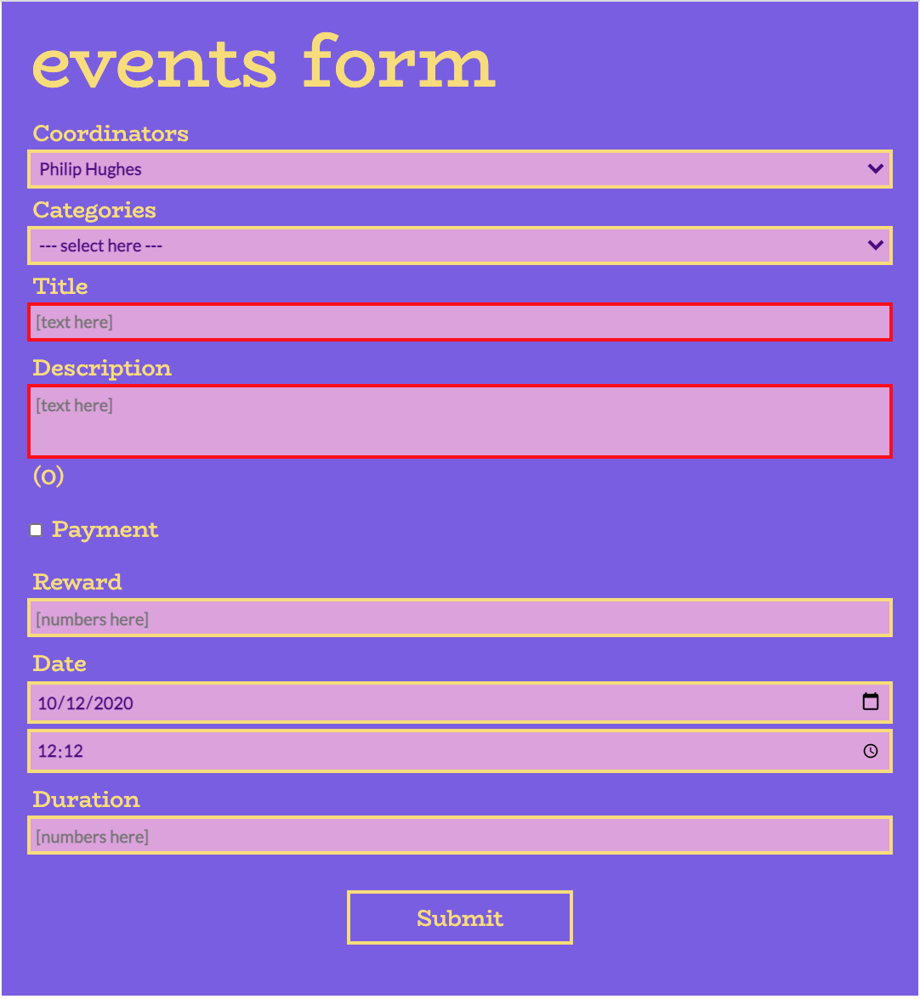

# Events Form App

## Completed

- React, hooks (e.g. useState, useEffect, custom useForm)
- Redux, store, thunk middleware
- Redux hooks (e.g. useSelector, useDispatch)
- Styled components, theme
- Native fetch to get data from API
- Form validation, utils to format output data e.g. find, reduce, every

## Screenshots

